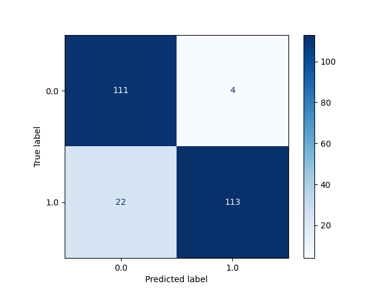

# CML basic use case

This repository contains a sample project using [CML](https://github.com/iterative/cml).

The steps of this project are:
- GitHub will deploy a runner machine with a specified CML Docker environment
- The runner will execute a workflow to train a Random Forest Classifier model (`python train.py`)
- A visual CML report about the model performance will be returned as a comment in the pull request

The key file enabling these actions is `.github/workflows/cml.yaml`.

## Secrets and environmental variables
The only environmental variable set in `.github/workflows/cml.yaml` is `GITHUB_TOKEN`, which is configured by default in every GitHub repository. No secrets must be set by the user. 

## Results
Here we compare the use o gridsearch in 2 models as Random Forest Classifier(Main) and Logistic Regressión(Branch_1)

# Confussion Matrix RFC

# Accuracy:
Test Accuracy: 0.864

# Confussion Matrix LR

# Accuracy:
Test Accuracy: 0.896
